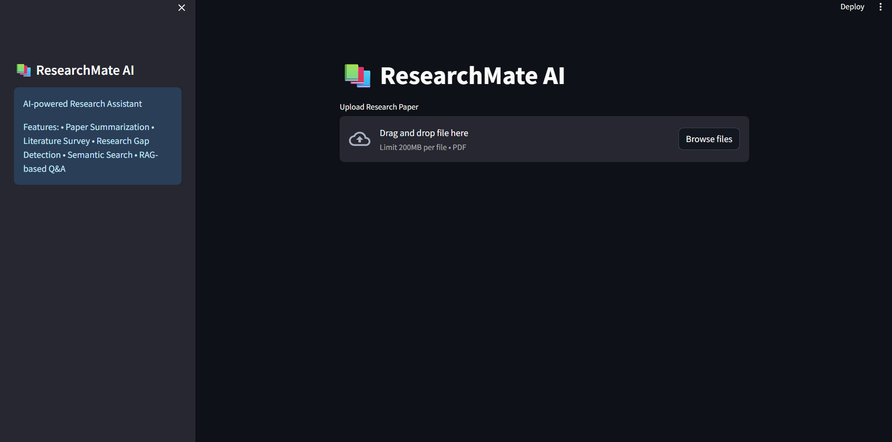
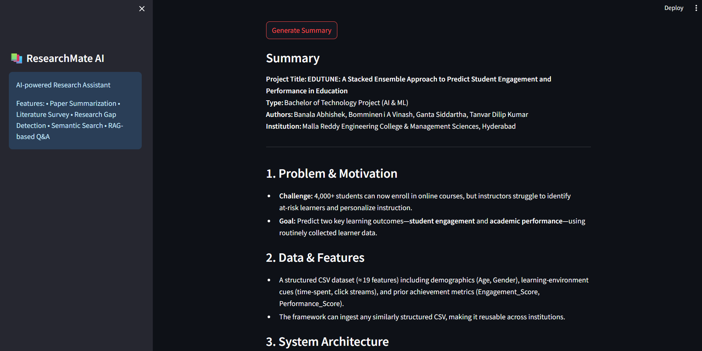

# ResearchMate AI

ResearchMate AI is a Retrieval-Augmented Generation (RAG)-based research assistant built using Streamlit, OpenRouter API, FAISS, and Sentence Transformers. It enables researchers and students to upload research papers, perform semantic search, generate summaries, create literature surveys, identify research gaps, and interact with academic documents through natural language queries.

## Features

* Upload PDF research papers
* Generate concise paper summaries
* Generate detailed literature surveys
* Identify research gaps and future work opportunities
* Extract key paper insights
* Chat with research papers using AI-powered semantic search
* Download generated outputs

## Tech Stack

* Python
* Streamlit
*  OpenRouter API
* OpenAI Python SDK
* Sentence Transformers
* FAISS
* LangChain Text Splitters
* PyPDF
* NumPy

## Project Architecture

1. Upload PDF Research Paper
2. Extract Text using PyPDF
3. Split Text into Chunks
4. Generate Embeddings using Sentence Transformers
5. Store Embeddings in FAISS Vector Database
6. Retrieve Relevant Context
7. Generate Responses using OpenRouter LLM

## Workflow

1. Upload a PDF research paper.
2. Extract text from the PDF.
3. Generate embeddings using Sentence Transformers.
4. Store embeddings in FAISS vector database.
5. Retrieve relevant chunks using semantic search.
6. Generate AI-powered responses using OpenRouter.
7. Download generated outputs.

## Repository Structure
```text
ResearchMate-AI/
│
├── app.py
├── requirements.txt
├── README.md
├── .gitignore
├── .env.example
└── screenshots/
```
## Installation

```bash
pip install -r requirements.txt
```

## Run the Application

```bash
streamlit run app.py
```

## Features Implemented

✅ Research Paper Summarization

✅ Literature Survey Generation

✅ Research Gap Detection

✅ Paper Insights Extraction

✅ Retrieval-Augmented Generation (RAG)

✅ Semantic Search using FAISS

✅ Interactive Streamlit Web Interface

✅ Downloadable Results

## Screenshots

### Home Page



### Chat with paper


### Research Paper Summary



### Literature Survey Generation


### Research Gap Analysis


## Future Enhancements

* Multi-PDF Comparison
* Citation Generation
* PDF Report Export
* Research Recommendation Engine
* Academic Knowledge Graph

## Author

Abhishek Banala

B.Tech - Computer Science and Engineering (AI & ML)

Malla Reddy Engineering College and Management Sciences
