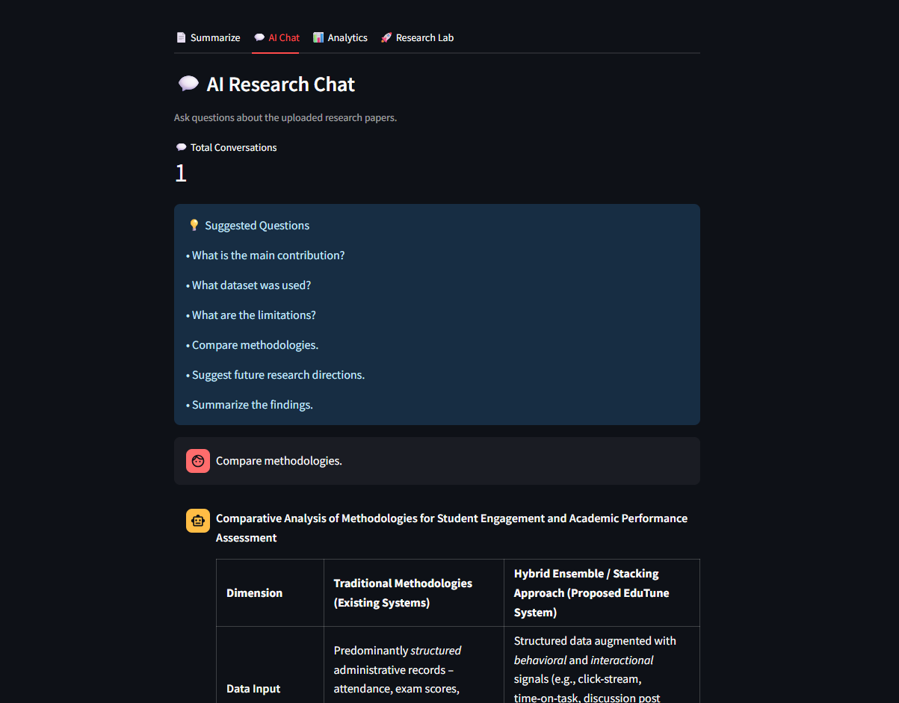
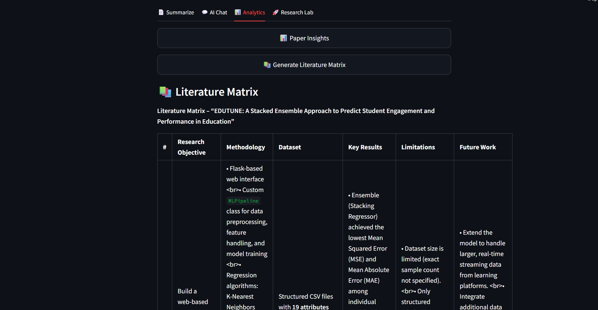
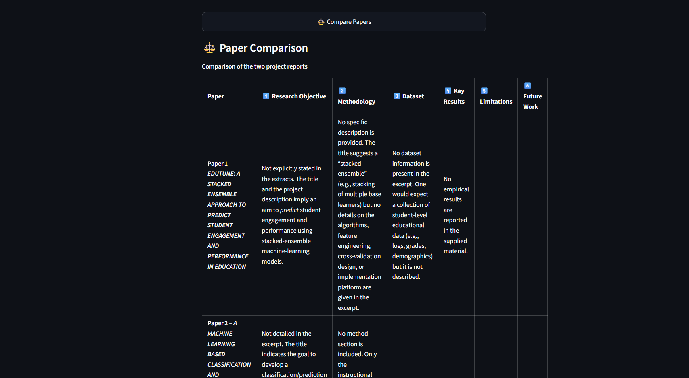
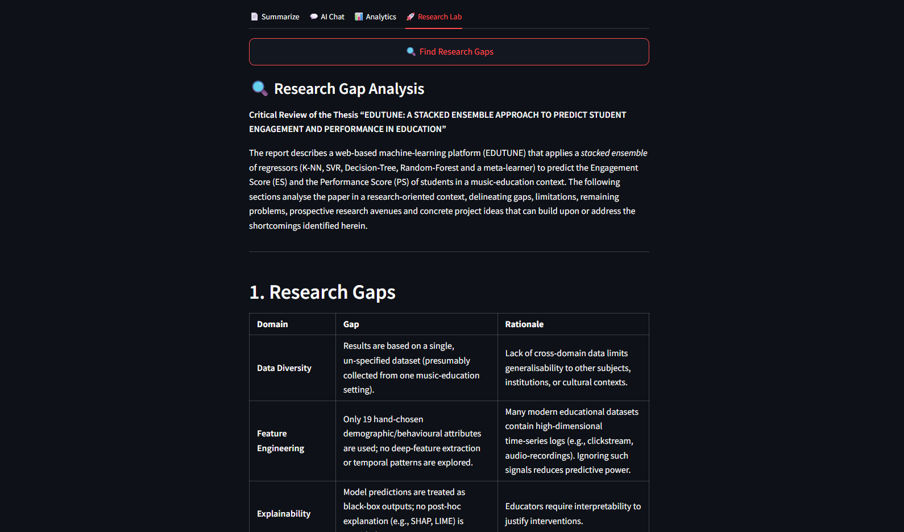
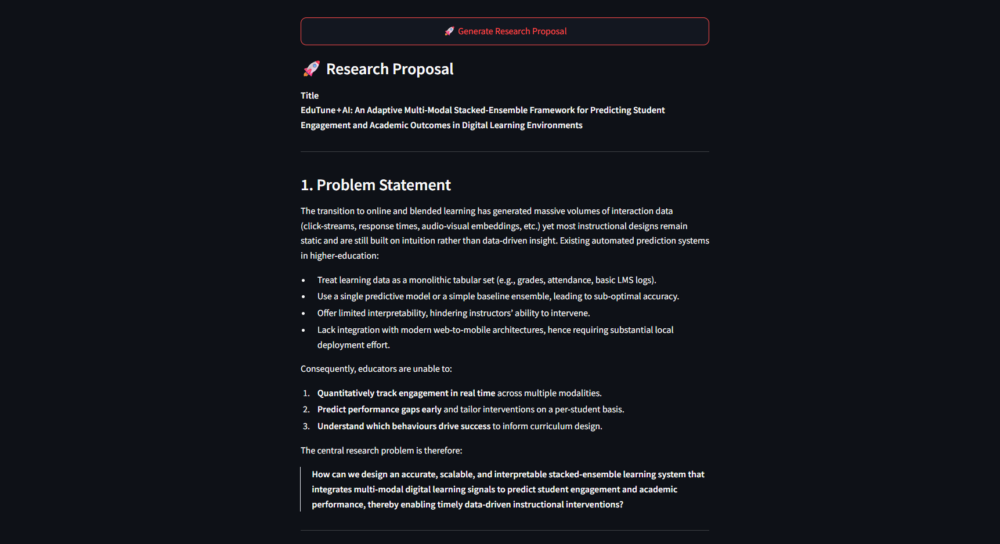

# 📚 ResearchMate AI

An AI-powered Research Assistant built using **Streamlit, OpenRouter, FAISS, and Sentence Transformers** that helps researchers, students, and academicians analyze research papers efficiently using Retrieval-Augmented Generation (RAG).


---

## 🎯 Why ResearchMate AI?

Researchers spend significant time reading, summarizing, and comparing academic papers. ResearchMate AI automates these tasks using modern Large Language Models (LLMs), semantic search, and Retrieval-Augmented Generation (RAG), enabling faster literature review and research exploration.

## 🚀 Features

### 📄 Research Paper Analysis

* Paper Summarization
* Abstract Generation
* Paper Insights Extraction
* Methodology Extraction
* Citation Generation
* Keyword Extraction

### 💬 AI Research Chat

* Chat with Research Papers
* RAG-based Question Answering
* Semantic Search using FAISS
* Multi-document Support
* Conversation History

### 📚 Literature Review

* Literature Survey Generation
* Literature Matrix Creation
* Multi-Paper Comparison

### 🔍 Research Intelligence

* Research Gap Detection
* Research Question Generation
* Research Proposal Generation
* Research Trend Analysis
* Topic Recommendations

### 📊 Research Dashboard

* Uploaded Papers Statistics
* Page Count Analytics
* Chunk Analytics
* Chat Analytics
* Interactive UI

### 📥 Export Features

* Download Summaries
* Download Literature Surveys
* Download Research Gap Reports
* Download Proposal Documents
* Download Chat History

---

## 🏗️ System Architecture

```text
PDF Upload
     │
     ▼
Text Extraction (PyPDF)
     │
     ▼
Text Chunking
     │
     ▼
Sentence Transformers
     │
     ▼
FAISS Vector Database
     │
     ▼
Semantic Retrieval
     │
     ▼
OpenRouter LLM
     │
     ▼
Research Insights & Answers
```

---

## 🛠️ Tech Stack

| Category               | Technology            |
| ---------------------- | --------------------- |
| Frontend               | Streamlit             |
| LLM API                | OpenRouter            |
| Embeddings             | Sentence Transformers |
| Vector Database        | FAISS                 |
| PDF Processing         | PyPDF                 |
| Language               | Python                |
| Environment Management | python-dotenv         |

---

## 📸 Screenshots

### 🏠 Home Dashboard


### 💬 AI Research Chat



### 📚 Literature Matrix



### ⚖️ Paper Comparison



### 🔍 Research Gap Analysis



### 🚀 Research Proposal




## ⚙️ Installation

### Clone Repository

```bash
git clone https://github.com/abhi03-git/ResearchMate-AI.git

cd ResearchMate-AI
```

### Install Dependencies

```bash
pip install -r requirements.txt
```

### Create Environment File

Create a `.env` file:

```env
OPENROUTER_API_KEY=your_api_key_here
```

### Run Application

```bash
streamlit run app.py
```

---

## 📂 Project Structure

```text
ResearchMate-AI/
│
├── app.py
├── requirements.txt
├── .env.example
├── README.md
│
├── screenshots/
│   ├── Home.png
│   ├── AI_Chat.png
│   ├── Literature_Matrix.png
│   ├── Paper_Comparison.png
│   ├── Research_Gaps.png
│   └── Research_Proposal.png
│
└── papers/
```

## ✨ Highlights

- Multi-PDF Research Analysis
- Retrieval-Augmented Generation (RAG)
- FAISS-based Semantic Search
- AI-powered Literature Review
- Research Proposal Generation
- Interactive Research Dashboard

---

## 🎯 Future Enhancements

* Research Paper Recommendation System
* Citation Network Analysis
* PDF Report Generation
* Multi-Agent Research Assistant
* Web Search Integration
* Research Paper Clustering
* Research Timeline Generation

---

## 👨‍💻 Author

Abhishek Banala

---

## ⭐ Support

If you find this project useful, please consider giving it a ⭐ on GitHub.
